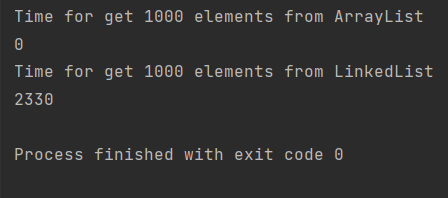

# ArrayList и LinkedList.
1. Напишите метод, который добавляет 1_000_000 элементов в ArrayList и LinkedList. 

2. Напишите еще один метод, который выбирает из заполненного списка элемент наугад 1000 раз. 

3. Замерьте время, которое потрачено на это. 

4. Сравните результаты и предположите, почему они именно такие.

### Output

ArrayList provides fast random read access, so the get operation takes only O(1) time.

For a LinkedList, the get operation takes O(n) time, as it must traverse the list from the beginning or from the end, 
whichever is closer.